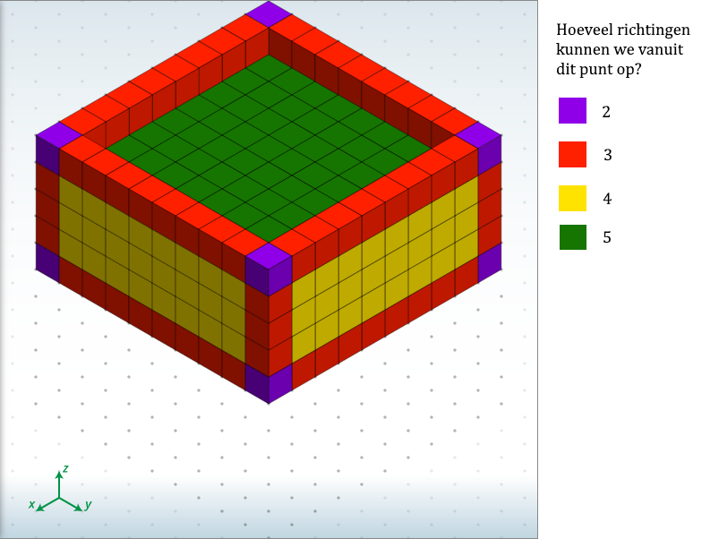

# Programmeertheorie: Chips & Circuits

* Course: Programmeertheorie, UvA
* Website: www.heuristieken.nl
* Casus: Chip & Circuits

## Casus

http://heuristieken.nl/wiki/index.php?title=Chips_%26_Circuits

### Analyse state space

Hoe groot is de state space nou eigenlijk?
Er zijn twee niveaus van complexiteit:
* In welke volgorde leg je de nets uit de netlist neer?

  Je kunt een netlist van k nets op k! verschillende volgorden sorteren. Al deze volgorden zijn anders en we weten niet welke het beste onze kosten optimizeren, dus ze zijn allemaal te overwegen.
  De grootste netlist van onze probleemtoestand bevat 70 nets. Deze kunnen we dus op 70! ≈ 1.2 * 10^100 verschillende volgorden sorteren.
  
* Nadat je een volgorde hebt gekozen om de nets te plaatsen, hoe leg je de nets neer?

  We hebben een chip met breedte x, lengte y en hoogte z. Dan heeft deze inhoud U = x * y * z, en we kunnen maximaal U stappen nemen. Dit is dus tevens de upper bound van onze total cost. Op elk punt kunnen we een aantal verschillende kanten op. Er zijn 6 verschillende richtingen: vier kanten op het vlak, naar boven en naar onderen. Maar vanuit elk punt kunnen we hooguit 5 richtingen op: vanuit een gate kunnen we niet naar onderen, en als we eenmaal vanuit de gate zijn gelopen kunnen we niet meer teruglopen. Als we in een hoek zitten kunnen we nog minder kanten op!
  
  Laten we zien hoe dat er uit ziet:
  
  
  
  Dus we kunnen een strakkere bovengrens dan 5^U verzinnen! 
  
  Zo zijn er 8 punten waarvan we hooguit 2 kanten op kunnen; alle hoeken op de uiterste lagen.
  
  Er zijn (z-2) * 4 + 2 * (2x + 2y - 8) punten waarvan we hooguit 3 kanten op kunnen; alle andere hoeken en de randpunten op de uiterste lagen.
  
  Er zijn (z-2) * (2x + 2y - 8) + 2 * (x-2) * (y-2) punten waarvan we hooguit 4 kanten op kunnen; alle andere randpunten en alle andere punten op de uiterste lagen.
  
  Vanuit alle andere punten, dit zijn er (x-2) * (y-2) * (z-2), kunnen we hooguit 5 kanten op.
  
  Er zijn dus tot wel  ≈ 3.1 * 10^1593 manieren om de nets neer te leggen.
  
De grootte van onze space state is het product van deze twee: 1.2 * 10^100 * 3.1 * 10^1593 = 3.7 * 10^1693 mogelijke oplossingen.
  

## Aan de slag

### Vereisten

Alle code is geschreven in Python3.7. Alle benodige packages staan in requirements.txt. De packages zijn te installeren volgens het volgende commando:

```
pip install -r requirements.txt
```

### Structuur

Het startpunt van het programma bevindt zich in het main.py file in de hoofd directory. De overige code staat in de map Code, met de algoritmes in de map Algorithms. Alle data staan in het mapje Data.De resultaten staan allemaal in Results

### Runnen

```
python main.py
```

## Auteurs
* Ivo de Brouwer
* Sjoerd Terpstra

## Dankwoord

