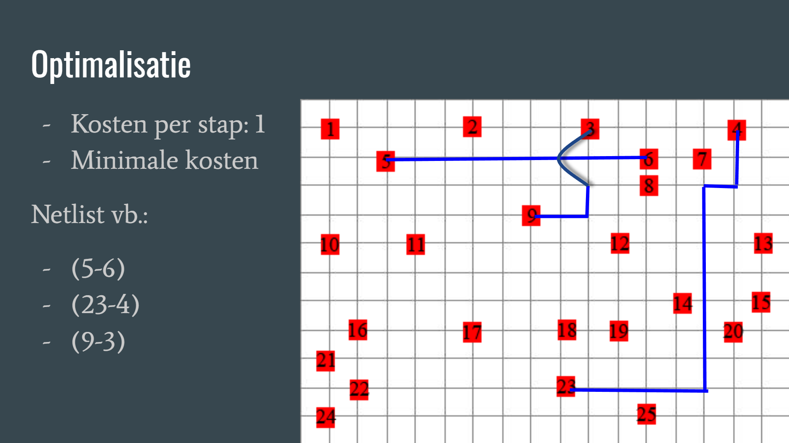
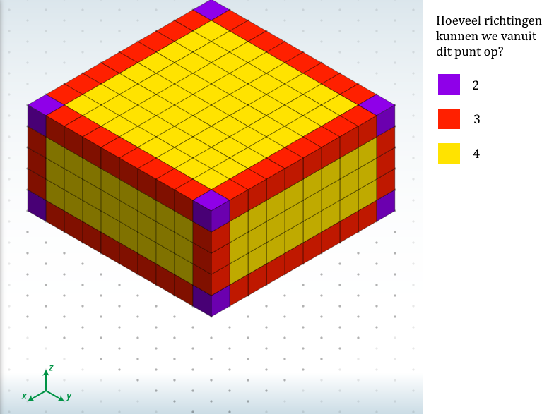

# Programmeertheorie: Chips & Circuits

* Course: Programmeertheorie, UvA
* Website: www.heuristieken.nl
* Casus: Chip & Circuits

## Casus

http://heuristieken.nl/wiki/index.php?title=Chips_%26_Circuits

Hallo geïnteresseerden! Onze casus is 'Chips and Circuits'. 
Hierbij kijken we naar circuits van 'gates' en proberen we daar verbindingen, ofwel 'nets', tussen te leggen.

Wij hebben een aantal netlists en circuits gekregen, en de opdracht gekregen om de nets uit de netlists op de circuits zo te verbinden dat alle nets worden geplaatst zonder intersecties. Elke net begint en eindigt bij een gate, ze kunnen dan ook niet door gates heen.

Een chip in onze opdracht heeft 8 lagen. We hoeven dus niet alleen in een vlak te werken; we kunnen ook omhoog en omlaag naar andere lagen. Alle gates bevinden zich op de onderste laag.

Elke stap die we nemen op het circuit kost 1 eenheid.

Het doel? Alle nets plaatsen, en de totale kosten zo laag mogelijk houden.



### Analyse state space

Hoe groot is de state space nou eigenlijk?
Er zijn twee niveaus van complexiteit:
* In welke volgorde leg je de nets uit de netlist neer?

  Je kunt een netlist van k nets op k! verschillende volgorden sorteren. Al deze volgorden zijn anders en we weten niet welke het beste onze kosten optimizeren, dus ze zijn allemaal te overwegen.
  De grootste netlist van onze probleemtoestand bevat 70 nets. Deze kunnen we dus op 70! ≈ 1.2 * 10^100 verschillende volgorden sorteren.
  
* Nadat je een volgorde hebt gekozen om de nets te plaatsen, hoe leg je de nets neer?

  We hebben een chip met breedte x, lengte y en hoogte z. Dan heeft deze inhoud U = x * y * z, en we kunnen maximaal U stappen nemen. Dit is dus tevens de upper bound van onze total cost. Op elk punt kunnen we een aantal verschillende kanten op. Er zijn 6 verschillende richtingen: vier kanten op het vlak, naar boven en naar onderen. Maar vanuit elk punt kunnen we hooguit 5 richtingen op: vanuit een gate kunnen we niet naar onderen, en als we eenmaal vanuit de gate zijn gelopen kunnen we niet meer teruglopen. Als we in een hoek zitten kunnen we nog minder kanten op!
  
  Laten we zien hoe dat er uit ziet:
  
  
  
  Dus we kunnen een strakkere bovengrens dan 5^U verzinnen! 
  
  Zo zijn er 8 punten waarvan we hooguit 2 kanten op kunnen; alle hoeken op de uiterste lagen.
  
  Er zijn (z-2) * 4 + 2 * (2x + 2y - 8) punten waarvan we hooguit 3 kanten op kunnen; alle andere hoeken en de randpunten op de uiterste lagen.
  
  Er zijn (z-2) * (2x + 2y - 8) + 2 * (x-2) * (y-2) punten waarvan we hooguit 4 kanten op kunnen; alle andere randpunten en alle andere punten op de uiterste lagen.
  
  Vanuit alle andere punten, dit zijn er (x-2) * (y-2) * (z-2), kunnen we hooguit 5 kanten op.
  
  Er zijn dus tot wel  ≈ 3.1 * 10^1593 manieren om de nets neer te leggen.
  
De grootte van onze space state is het product van deze twee.
Als we de grootste netlist van 70 nets en het grote circuit van 18 bij 17 bij 8 invullen krijgen we:

1.2 * 10^100 * 3.1 * 10^1593 = 3.7 * 10^1693 mogelijkheden.

### Wat maakt ons probleem moeilijk?

De grootte van de state space maakt het natuurlijk heel lastig om een optimale oplossing te vinden. Maar ook simpelweg het plaatsen van alle nets kan heel lastig worden. Zo kan het bijvoorbeeld gebeuren dat een gate geen beschikbare buren meer heeft, en dus een van de nets niet geplaatst kan worden. Vooral bij de grotere netlists kan dit al snel gebeuren, in welke volgorde je de nets ook probeert te plaatsen. 

Als je de nets één voor één optimaal probeert te plaatsen, kom je al gauw vast te zitten. Maar zodra je een net suboptimaal plaatst om ruimte over te houden voor volgende nets, kun je niet meer zeker weten of je totale kosten zo laag mogelijk zijn. Hierdoor is het erg moeilijk om een oplossing te vinden met zo min mogelijk kosten.

### Methode

Hoe hebben we dit aangepakt? 

Voor het sorteren van de netlists hebben we een genetisch algoritme gebruikt.

Voor het neerleggen van de nets hebben we gebruik gemaakt van een greedy pathfinding algoritme, en van A*, een bekend pathfinding algoritme.

*Deze algoritmes worden uitgelegd en besproken in /code/README.md*

### Vergelijken van oplossingen

Stel voor: we proberen onze nets neer te leggen door willekeurig door ons circuit te lopen. Wat blijkt nu? We komen al bij de eerste paar nets vast te zitten, omdat we geen idee hebben welke kant we op moeten lopen. Hiervoor hebben we algoritmes nodig. 

Een greedy algoritme dat direct naar het doel probeert te gaan kan al zo'n 10 nets neerleggen voordat het vastloopt.
Een beter pathfinding algoritme zoals A* loopt vast na zo'n 20 nets. We moeten uiteindelijk 70 nets neer kunnen leggen om een oplossing te vinden voor het grootste netlist. We hebben dus heuristieken nodig om slimmer de nets neer te leggen. Het is dan ook een heel gedoe om een oplossing te vinden, laat staan een efficiente met lage kosten.

Als we eenmaal een oplossing hebben gevonden die alle nets kan plaatsen, kunnen we kijken hoe hoog de kosten zijn, relatief tot de upper en lower bounds, en tot de kosten van andere oplossingen. Een oplossing die alle 70 nets kan plaatsen met 2000 eenheden aan kosten is nog steeds beter dan eentje die 69 van de nets kan plaatsen met slechts 1000 eenheden aan kosten. Als we eenmaal meerdere oplossingen voor alle netlists hebben verkregen kunnen we gaan kijken naar hoe laag de totale kosten zijn ten opzichte van elkaar en de upper/lower bounds.


## Aan de slag

### Vereisten

Alle code is geschreven in Python3.7. Alle benodige packages staan in requirements.txt. De packages zijn te installeren volgens het volgende commando:

```
pip install -r requirements.txt
```

### Structuur

Het startpunt van het programma bevindt zich in het main.py file in de hoofd directory. De overige code staat in de map Code, met de algoritmes in de map Algorithms. Alle data staan in het mapje Data.De resultaten staan allemaal in Results

### Runnen

Om het programma met standaardinstellingen te runnen voer het volgende commando uit:

```
python main.py
```

Voor een overzicht van alle opties en hulp bij runnen, voer het volgende commando uit:

```
python main.py -h
```

### Visualization

Momenteel werkt de visualizatie niet met de huidige algoritmes in de master branch. Om de visualizaties te kunnen zien, gebruik de files uit vizualisationBranch en run de volgende commands:

```
pip install requirements.txt
```

```
python main.py
```

## Auteurs
* Ivo de Brouwer
* Sjoerd Terpstra

## Dankwoord

